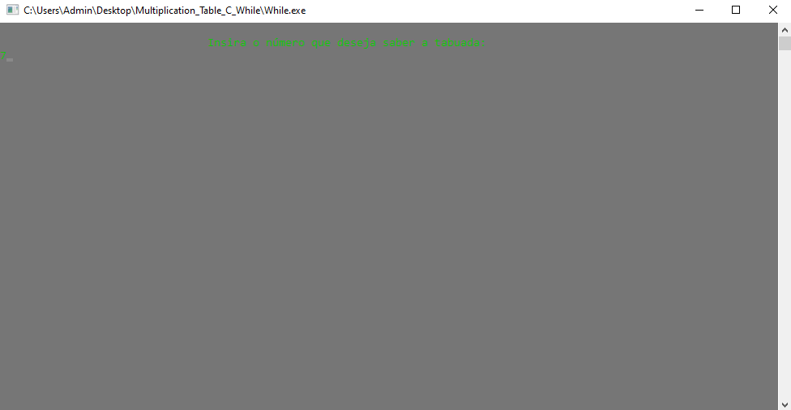
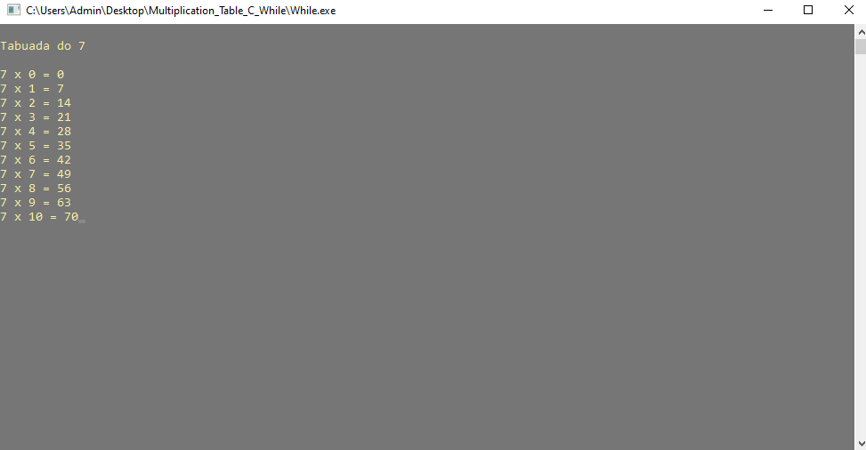
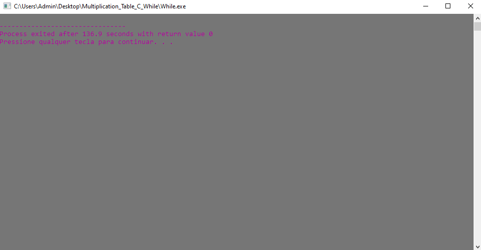

<div align="center" style="display: inline_block;">
  <a href="https://learn.microsoft.com/pt-br/cpp/c-language/?view=msvc-170" title="C | DOC" target="_blank" rel='noopener noreferrer'>
    
  </a>
</div><br>

<div align="center";>
  <h1>TABUADA COM WHILE 🔢</h1>
</div>

Este repositório em **C** fornece um programa que calcula a tabuada de um número fornecido pelo usuário. O usuário insere um número, e o programa utiliza um laço `while` para gerar e exibir a tabuada desse número de 0 a 10. O laço `while` é crucial para repetir a operação de multiplicação e formatar a saída, permitindo que a tabuada completa seja exibida de maneira clara e organizada no console.

## 🖥️ Explicação do Código

**Inclusão de Bibliotecas:**

- Estas bibliotecas são necessárias para funções de entrada/saída, manipulação de memória e configuração regional.

```c
#include <stdio.h>
#include <stdlib.h>
#include <locale.h>
```
**Função Principal:**

- A função principal onde a execução do programa começa. A configuração regional é definida para `"Portuguese"` para suportar caracteres especiais.

```c
int main(int argc, char *argv[]) {
    setlocale (LC_ALL, "Portuguese");
```

**Declaração de Variáveis:**

- Declaração das variáveis `x` e `n`, onde `x` é o número escolhido pelo usuário e `n` é usado para iterar na tabuada.

```c
int x, n;
```

**Configuração de Cor e Entrada do Usuário:**

- Define a cor do texto no console para um tom específico, solicita que o usuário insira um número, e limpa a tela do console após a entrada.

```c
system ("color 8A");
printf ("\n\t\t\t\tInsira o número que deseja saber a tabuada: \n");
scanf ("%d", &x);
system ("cls");
```

**Exibição da Tabuada e Laço while:**

- Define a cor do texto no console para outro tom e exibe a tabuada do número inserido pelo usuário, de 0 a 10.

- O laço `while` é utilizado para iterar de 0 a 10, calculando e exibindo o produto do número fornecido (`x`) com o índice (`n`). Cada iteração exibe uma linha da tabuada. Em cada iteração, o valor de `n` é incrementado, e o produto `x * n` é exibido no console.

```c
system ("color 8E");
printf ("\nTabuada do %d\n", x);

while (n <= 10) {
    printf ("\n%d x %d = %d", x, n, x * n);
    n++;
}
```

**Pausa e Limpeza da Tela:**

- Aguarda a entrada do usuário antes de limpar a tela e mudar a cor do texto para outro tom. Depois, aguarda novamente a entrada do usuário antes de finalizar o programa.

```c
getch();

system ("cls");
system ("color 8D");

getch();
return 0;
```

## 📸 Imagens do Projeto em Funcionamento

<table>
  <tr>
    <td align="center">
      
      <p>Tela inicial</p>
    </td>
    <td align="center">
      
      <p>Inserção do número 7</p>
    </td>
    <td align="center">
      
      <p>Resultado da tabuada do 7</p>
    </td>
    <td align="center">
      
      <p>Fim da operação</p>
    </td>
  </tr>
</table>